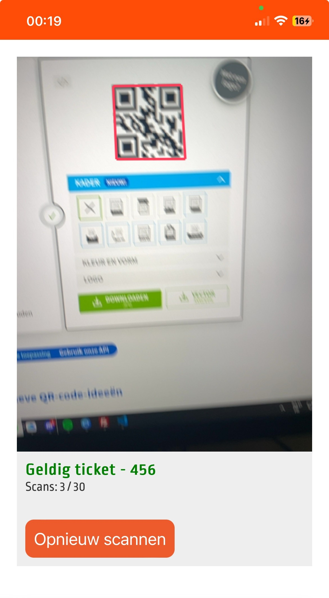
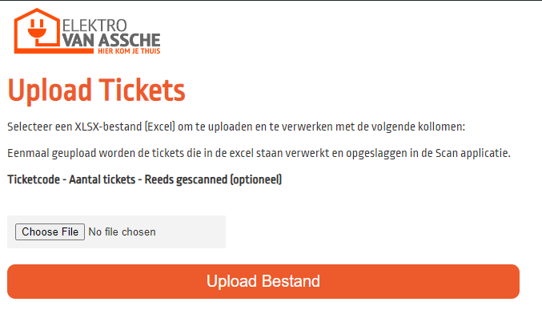

# Ticket QR Scanner

QR Scanner is a lightweight, efficient QR code scanning application designed to quickly and accurately decode QR codes and check them in the ticket database. Developed with a focus on user-friendliness and being lightweight, this tool is perfect for users needing a reliable QR code reading solution with a simple setup.

## Features

- **Fast QR code scanning:** Quickly scans QR codes from images or live camera feeds.
- **User-friendly interface:** Easy-to-navigate interface for a seamless scanning experience.
- **Cross-platform compatibility:** Designed to work across various devices, ensuring accessibility and convenience.
- **Uploader:** Easy tickets uploading at the `/ticketuploader` endpoint.

## Getting Started

These instructions will get you a copy of the project up and running on your local machine for development and testing purposes.

### Prerequisites

Install the requirements by typing `pip install -r requirements.txt` in terminal.

After installation, simply run the `api.py` file to get started. The application is hosted on port 80 on localhost by default.

## Images/Screenshots

Below are some screenshots and images showcasing the QR Scanner application in action. These visuals provide insight into the user interface and functionality offered by the application.

### Scan Result

After scanning a QR code, the application displays the ticket code, if the ticket is valid, the amount of scans it already has and a button to scan a new ticket.

### Add tickets

By uploading a simple XLSX-file (excel) in the given format, you can initialize the ticket database.

